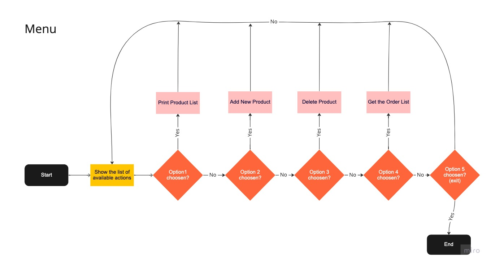
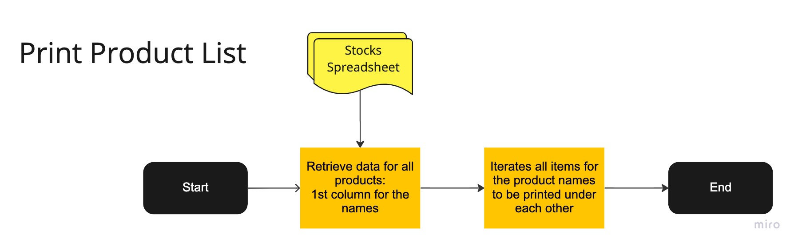
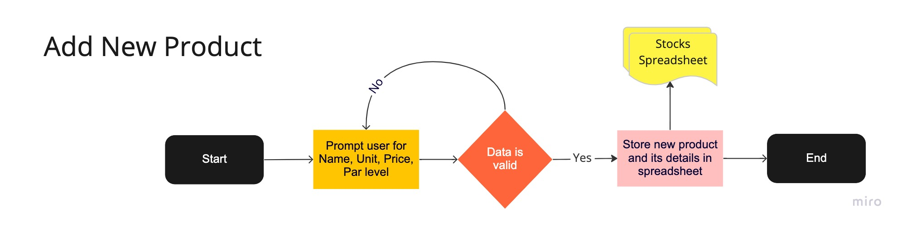
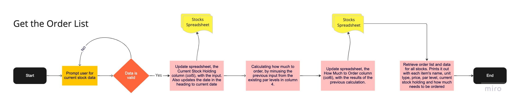
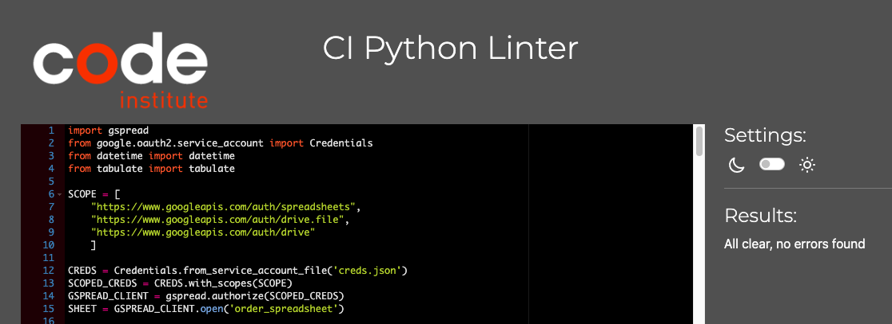

# OrderEasy Application

This application is designed to cater to the needs of all users who work in any environment that involves stocks and their management, especially the ordering part. The primary objective of the app is to simplify and speed up the process of managing stocks for its users. 
The main focus is to be straight forward enough to save time for the user, yet to be engaging and motivating at the same time.

The user can interact with the application in various ways such as viewing the current list of products, adding or removing products with relevant details from the stock list. The app also assists the user in determining how much of each product needs to be ordered based on their input of current stock holding information, which is compared to par levels by the application.

Furthermore, the app stores all stock information and data in an external Google Spreadsheet for easy access and management.

[Link to the live project](https://order-easy-python-milestone.herokuapp.com/)

The business goals of this website are:
  -	To deliver a high-quality application that addresses all stock management issues efficiently
  -	To provide an excellent user experience that is both efficient for each client and easy to use
  - To simplify the management of the product list, thanks to the use of Google Spreadsheet and the update options 
    on the app
  - To always provide accurate results with the current date noted

The customer goals of this website are:
  -	To search for an application that is user-friendly and easy to navigate
  -	To have a website where they can easily add, remove, and change their product list to adapt to current trends and needs
  - to reduce the amount of time users have to spend away from their customers while managing their stocks 
    and placing orders for new items
  - To make stock management and ordering simpler and easier to train new employees, ultimately reducing stress and 
    improving overall efficiency

# Contents

- [User Experience (UX)](https://github.com/Lilla-Kavecsanszki/order-easy#user-experience-ux)
- [Ideal client](https://github.com/Lilla-Kavecsanszki/order-easy#ideal-client)
- [User stories](https://github.com/Lilla-Kavecsanszki/order-easy#user-stories)
- [Wireframes](https://github.com/Lilla-Kavecsanszki/order-easy#wireframes---chart)
- [Accessibility](https://github.com/Lilla-Kavecsanszki/order-easy#accessibility)
- [Languages Used](https://github.com/Lilla-Kavecsanszki/order-easy#languages-used)
- [Technologies Used](https://github.com/Lilla-Kavecsanszki/order-easy#technologies-used)
- [Features](https://github.com/Lilla-Kavecsanszki/order-easy#features)
  - [Home](https://github.com/Lilla-Kavecsanszki/friends-quiz#home)
  - [How to Play?](https://github.com/Lilla-Kavecsanszki/friends-quiz#how-to-play)
- [Deployment](https://github.com/Lilla-Kavecsanszki/order-easy#deployment)
- [Local Deployment](https://github.com/Lilla-Kavecsanszki/order-easy#local-deployment)
  - [How to Clone](https://github.com/Lilla-Kavecsanszki/order-easy#how-to-clone)
  - [How to Fork](https://github.com/Lilla-Kavecsanszki/order-easy#how-to-fork)
- [Testing](https://github.com/Lilla-Kavecsanszki/order-easy#testing)
  - [Manual Testing](https://github.com/Lilla-Kavecsanszki/order-easy#manual-testing)
  - [User Stories Testing](https://github.com/Lilla-Kavecsanszki/order-easy#user-stories-testing)
  - [Further Testing](https://github.com/Lilla-Kavecsanszki/order-easy#further-testing)
  - [Bugs](https://github.com/Lilla-Kavecsanszki/order-easy#bugs)
- [Credits](https://github.com/Lilla-Kavecsanszki/order-easy#credits)
  - [Content](https://github.com/Lilla-Kavecsanszki/order-easy#content)
  - [Acknowledgments and Code](https://github.com/Lilla-Kavecsanszki/order-easy#acknowledgments-and-code)
  - [Disclaimer](https://github.com/Lilla-Kavecsanszki/order-easy#disclaimer)

# User Experience (UX)

### Ideal client

The ideal client for this business is:

-	English speaking
-	Works with any types of stock
-	Need to order stocks
-	Individuals, or companies

Visitors of this app search for:
-	A knowledgeable app...

This website is the best way to help them achieve these goals because:
-	Most other similar sites are limited in 
 
-	The website also offers 
.
.
.

This website:
-	Is easy to navigate by the menu
-	Gives the customers options and access to useful and learnable information.
-	Gives the customers the information they need without overloading them or distracting them from their original ideas or 
  wishes.
-	Guides them by their curiosity about the goal of the website.

[Back to top](https://github.com/Lilla-Kavecsanszki/order-easy#contents)

### User stories

1.	As a viewer of the website, I want to easily navigate the site, so I can find what I need, 
2.	As a potential new visitor to the website, I want to understand what my options are
3.	As a viewer of the website, I want to be able to see the results and the date when the data was entered, and requested 
4.	As an interested observer and/or hiring manager, I want to be able to find the web developer and see other projects 
    from her on social media and industry-relevant sites.

[Back to top](https://github.com/Lilla-Kavecsanszki/order-easy#contents)

# Flow Charts

Home page - Menu
 

Option1 - Print Product List
 

Option2 - Add New Product
 

Option3 - Delete Product
 

Option4 - Get the Order List
 

 

[Back to top](https://github.com/Lilla-Kavecsanszki/order-easy#contents)

# Languages Used

Python was used to complete this project.

[Back to top](https://github.com/Lilla-Kavecsanszki/order-easy#contents)

# Frameworks, Libraries, Programs & Technologies Used

- [Miro](https://miro.com/) was used to create the flow charts
- Github was used as the respository for the projects code after being pushed from Git
- Git was used for version control by the Gitpod terminal to commit to Git and Push to GitHub; to create and edit all 
  original code
- Google Spreadsheets was used as the external data store for stock data used by the project
- Google Drive API was used to generate credentials used in the project to securely access the Google Spreadsheet
- Google Sheets API was used to support interactions (e.g. read/write functionality) between the code and data stored in 
  the Google Spreadsheet
- gspread is the Python API for Google Sheets
- Google Auth is the Google authentication library for Python required to use the credentials generated for Google Drive 
  API
- Heroku was used to deploy the application and provides an enviroment in which the code can execute

[Back to top](https://github.com/Lilla-Kavecsanszki/order-easy#contents)

# Features

The Order Easy application includes 
.
.
.
 

#### Home

The Home page features a 
.
.

After the 
.
.
.

After this section, there are ...

After clicking on the buttons, .
.
.

This ...also features a ...

On the same line ....

Under the ...

When the user finishes with all ....

First, ...

Then a ...

And lastly, ...

#### How to Play? 

On the top, the ...

Underneath there is an ....

Under the instructions section, there is ...

[Back to top](https://github.com/Lilla-Kavecsanszki/order-easy#contents)

# Deployment

The OrderEasy website is deployed using Heroku, this was done by:

1. Add dependencies in GitPod to requirements.txt file with command "pip3 freeze > requirements.txt"
2. Commit and push to GitHub
3. Go to the Heroku Dashboard
4. Click "Create new app"
5. Name app and select location
6. Choose the Settings tab and add Config Vars for Creds and Port (creds.json file)
   (as a second entry also add PORT for the key and 8000 for the value)
7. Add the buildbacks to Python and NodeJS in that order
8. Now go to Deploy tab
9. Select GitHub as deployment method
10. Connect to GitHub and link to repository
11. Enable automatic deployment or deploy manually
12. Click on Deploy

[Back to top](https://github.com/Lilla-Kavecsanszki/order-easy#contents)

# Local Deployment

## How to Clone

Locate the main page of friends-quiz repository, click the Code button to the left of the green Gitpod button, then choose Local. Copy the URL of the repository, you can click on headings for HTTPS, SSH, and Github CLI to find their individual links. Open your own terminal in your editor and change the current working directory to the location of where you want the cloned directory to be. In the terminal type git clone, and then paste the URL you copied from friends-quiz repository page. Press enter to complete.

[Back to top](https://github.com/Lilla-Kavecsanszki/order-easy#contents)

## How to Fork

Locate the main page of friends-quiz repository. Click the fork button in the top right of the screen, between the watch, and the star buttons.

[Back to top](https://github.com/Lilla-Kavecsanszki/order-easy#contents)

# Testing

Python Validator result on the run.py file

## Manual Testing

**Home Page:**

respond correctly and look good on all device widths.

**Let's start link:** Reduce and expand the width of the window to confirm that the text responds correctly and looks good on all device widths. Click on the link item and verify that it links to the correct part of the page and takes the user to the character buttons to be able to choose one. Hover over the link and verify the hover colour change work as expected. Click on the link item and the audio starts as expected. The speaker icon at the beginning warns the user that the link will have sound.

**Audio control buttons:** Reduce and expand the width of the window to verify that the icon buttons display behave and centre as expected and that they look good on all device widths. Hover over the buttons and verify the hover colour change work as expected as well as the zoom-out animation. Click the stop button and the audio stops. Click the play button and the audio carries on from where it was stopped beforehand. If the audio finished, clicking the play button would start over the audio from the beginning.

**? page:**

**Hamburger menu:** Repeat the verification steps done for the navbar on the Home page. Confirm that the hamburger menu code is identical on all HTML pages.

**Instructions:** Go to the "How to play?" page from a desktop. Reduce and expand the width of the window to confirm that the title and all paragraph texts respond correctly, centre as expected and look good on all device widths. I had to adjust font size and padding-top of the title for this on smaller screen sizes.

Review all functionality and responsiveness on my mobile phone and tablet for all pages.

[Back to top](https://github.com/Lilla-Kavecsanszki/order-easy#contents)

## User Stories Testing 

1.	As a viewer of the website, I want to easily navigate the site, so I can find what I need, most importantly, to 
    find the quiz efficiently.

    - Regardless of which page the viewer is on, they can easily find and use the navigation bar, it also stays visible and on top of the screen even while scrolling.

    

2.	As a potential new visitor to the website, I want to understand what the game is about and its rules.

    - By using the sticky navigation menu the user can easily navigate at any time to the "How to play?" page and read the instructions and purpose of the website. 

    

3.  As a viewer of the website, I want to be able to see my final result and progression in the meantime.

    - After each round, after choosing an answer to the last, tenth question, the user will receive their final points that they achieved with a relevant message along, as well. This information will be displayed in the place of the quiz.
    
    

    - With the interactive question counter bar and the score counter on the opposite side, the user can keep track of their journey and success in the game.
    
    

4.  As an interested observer and/or hiring manager, I want to be able to find the web developer and see other projects 
    from her on social media and industry-relevant sites

    - Two website link icons can be found in the footer on every page of the website. One takes the visitor to the web developer’s LinkedIn profile page and the other to her Github profile page.
    
    .  

[Back to top](https://github.com/Lilla-Kavecsanszki/order-easy#contents)

## Further testing

I asked friends and family to look at the site on their devices and browsers and report any issues they find. The height of the logo image was adjusted as a result of this on the Home page and also in media queries respectively. It was covering the let’s start button, the audio control buttons and the Rachel button in the middle of the page, therefore those didn’t work until the issue was resolved.

[Back to top](https://github.com/Lilla-Kavecsanszki/order-easy#contents)

## Bugs

A few issues came up while testing the website in the meantime; 

1. The encouraging message didn't work properly at some stage. This was an easy fix, as I realised that I was getting the wrong id from the html file, so after this was linked to the correct element.

[Back to top](https://github.com/Lilla-Kavecsanszki/order-easy#contents)

# Credits

## Content

The Google spreadsheet (order_spreadsheet) that the application uses has the following fictitious initial data which was set up manually by the author:

Stocks Sheet

[Back to top](https://github.com/Lilla-Kavecsanszki/order-easy#contents)

## Acknowledgments and Code

I received inspiration for this project from my personal experience working in the hosptality industry, as well as from my partner's struggles with similar issues at his job. In addition, I reviewed the work of other students to gain a better understanding of project scope and to identify best practices for Milestone Project 3.

 https://stackoverflow.com/questions/74665788/how-to-convert-string-to-number-in-python
 how to convert data into integers and floats 

 https://docs.gspread.org/en/latest/user-guide.html#updating-cells
 How to update cells and work the spreadsheet
 https://docs.gspread.org/en/latest/user-guide.html#getting-all-values-from-a-row-or-a-column
 https://stackoverflow.com/questions/14625617/

 https://stackoverflow.com/questions/30989213/can-i-control-the-output-of-insert-row-in-gspread

 checking data types
 https://stackoverflow.com/questions/1549801/what-are-the-differences-between-type-and-isinstance
 https://stackoverflow.com/questions/1549801/what-are-the-differences-between-type-and-isinstance

 https://www.askpython.com/python/examples/exit-a-python-program

 Menu
 https://computinglearner.com/how-to-create-a-menu-for-a-python-console-application/?utm_content=cmp-true

Delete a row that is containing a certain data
how-to-delete-remove-row-from-the-google-spreadsheet-using-gspread-lib-in-pytho
https://stackoverflow.com/questions/65313107/python-google-sheets-api-searching-for-a-certain-string-and-returning-the-wh
https://stackoverflow.com/questions/61599272/google-sheets-search-column-for-value-using-python
https://docs.gspread.org/en/v5.3.0/api.html

Print into table format - order results
https://www.geeksforgeeks.org/how-to-make-a-table-in-python/

How to edit a dropdown link in the README
https://chrisfrew.in/blog/dropdowns-in-readmes/

.
.
.

## Disclaimer

This application is for educational use only.

[Back to top](https://github.com/Lilla-Kavecsanszki/order-easy#contents)