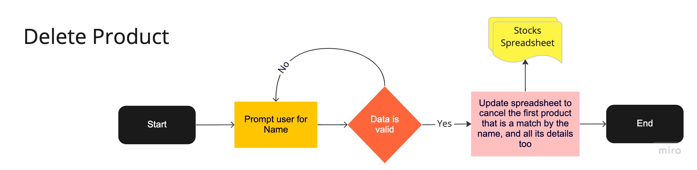
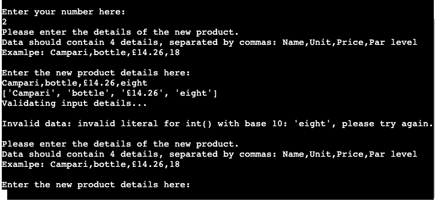
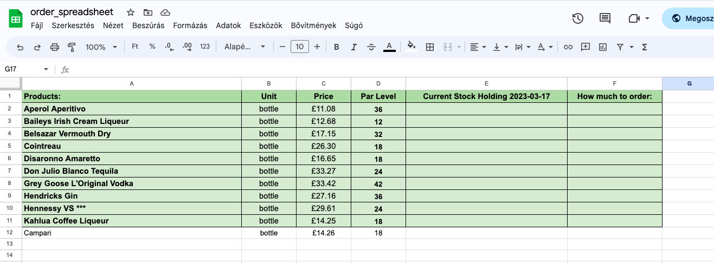
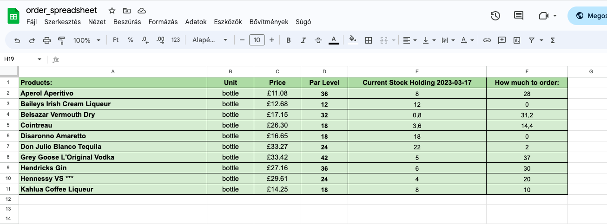

# OrderEasy Application

This application is designed to cater to the needs of all users who work in any environment that involves stocks and their management, especially the ordering part. The primary objective of the app is to simplify and speed up the process of managing stocks for its users. 
The main focus is to be straight forward enough to save time for the user, yet to be engaging and motivating at the same time.

The user can interact with the application in various ways such as viewing the current list of products, adding or removing products with relevant details from the stock list. The app also assists the user in determining how much of each product needs to be ordered based on their input of current stock holding information, which is compared to par levels by the application.

Furthermore, the app stores all stock information and data in an external Google Spreadsheet for easy access and management.

[Link to the live project](https://order-easy-python-milestone.herokuapp.com/)

The business goals of this website are:
  -	To deliver a high-quality application that addresses all stock management issues efficiently
  -	To provide an excellent user experience that is both efficient for each client and easy to use
  - To simplify the management of the product list, thanks to the use of Google Spreadsheet and the update options 
    on the app
  - To always provide accurate results with the current date noted

The customer goals of this website are:
  -	To search for an application that is user-friendly and easy to navigate
  -	To have a website where they can easily add, remove, and change their product list to adapt to current trends and needs
  - to reduce the amount of time users have to spend away from their customers while managing their stocks 
    and placing orders for new items
  - To make stock management and ordering simpler and easier to train new employees, ultimately reducing stress and 
    improving overall efficiency

# Contents

- [User Experience (UX)](https://github.com/Lilla-Kavecsanszki/order-easy#user-experience-ux)
- [Ideal client](https://github.com/Lilla-Kavecsanszki/order-easy#ideal-client)
- [User stories](https://github.com/Lilla-Kavecsanszki/order-easy#user-stories)
- [Flow Charts](https://github.com/Lilla-Kavecsanszki/order-easy#flow-charts)
- [Languages Used](https://github.com/Lilla-Kavecsanszki/order-easy#languages-used)
- [Frameworks, Libraries, Programs & Technologies Used](https://github.com/Lilla-Kavecsanszki/order-easy#frameworks-libraries-programs--technologies-used)
- [Features](https://github.com/Lilla-Kavecsanszki/order-easy#features)
  - [Home](https://github.com/Lilla-Kavecsanszki/friends-quiz#home)
  - [How to Play?](https://github.com/Lilla-Kavecsanszki/friends-quiz#how-to-play)
- [Deployment](https://github.com/Lilla-Kavecsanszki/order-easy#deployment)
- [Local Deployment](https://github.com/Lilla-Kavecsanszki/order-easy#local-deployment)
  - [How to Clone](https://github.com/Lilla-Kavecsanszki/order-easy#how-to-clone)
  - [How to Fork](https://github.com/Lilla-Kavecsanszki/order-easy#how-to-fork)
- [Testing](https://github.com/Lilla-Kavecsanszki/order-easy#testing)
  - [Manual Testing](https://github.com/Lilla-Kavecsanszki/order-easy#manual-testing)
  - [User Stories Testing](https://github.com/Lilla-Kavecsanszki/order-easy#user-stories-testing)
  - [Further Testing](https://github.com/Lilla-Kavecsanszki/order-easy#further-testing)
  - [Bugs](https://github.com/Lilla-Kavecsanszki/order-easy#bugs)
- [Credits](https://github.com/Lilla-Kavecsanszki/order-easy#credits)
  - [Content](https://github.com/Lilla-Kavecsanszki/order-easy#content)
  - [Acknowledgments and Code](https://github.com/Lilla-Kavecsanszki/order-easy#acknowledgments-and-code)
  - [Disclaimer](https://github.com/Lilla-Kavecsanszki/order-easy#disclaimer)

# User Experience (UX)

### Ideal client

The ideal client for this business is:

-	English speaking
-	Works with any types of stock
-	Need to order stocks
-	Individuals, or companies

Visitors of this app search for:
-	A knowledgeable app that is easy to use
- That helps reducing the user's time spending on this specific task
- That is relyable and accurate

This application is the best way to help them achieve these goals because:
-	The menu makes the access of different commands very easy to execute
- The menu keeps coming back on display until the user chooses to exit the app
- The program will display all relevant information that can be necessary to order the products; with their name, unit types, prices, how much the user currently has on stock, the ideal par level and therefore how much needs to be ordered. 
- The product list can be easily updated with a new product and/or deleting one. 

This application:
-	Is easy to navigate by the menu
-	Gives the customers options and access to useful and learnable information.
-	Gives the customers the information they need without overloading them or distracting them from their original ideas or 
  wishes.
-	Guides them by their curiosity about the goal of the website.

[Back to top](https://github.com/Lilla-Kavecsanszki/order-easy#contents)

### User stories

1.	As a user of the application, I want to easily navigate the app, so I can find what I need quickly
2.	As a potential new user to the application, I want to understand what my options are
3.	As a user of the application, I want to be able to retrieve the list of products that I have on stocks to make the stock count, and therefore the later input faster, more efficient.
4.	As a user of the application, I want to be able to add a new product to the stock list, in case my business needs a new, different product with time
5.	As a user of the application, I want to be able to remove, delete an existing product from the stock list, in case my business doesn't need that specific product anymore
6. As a user of the application, I want to be able to see the results, as in how much I need to order and the date when the data was entered, and requested too
7. As a user of the application, I want to be able to see the relevant information of each product when I am ready to order them for better consideration, including their price, units as well. 

[Back to top](https://github.com/Lilla-Kavecsanszki/order-easy#contents)

# Flow Charts

Home page - Menu
 

Option1 - Print Product List
 

Option2 - Add New Product
 

Option3 - Delete Product
 

Option4 - Get the Order List
 

 

[Back to top](https://github.com/Lilla-Kavecsanszki/order-easy#contents)

# Languages Used

Python was used to complete this project.

[Back to top](https://github.com/Lilla-Kavecsanszki/order-easy#contents)

# Frameworks, Libraries, Programs & Technologies Used

- [Miro](https://miro.com/) was used to create the flow charts
- Github was used as the respository for the projects code after being pushed from Git
- Git was used for version control by the Gitpod terminal to commit to Git and Push to GitHub; to create and edit all 
  original code
- Google Spreadsheets was used as the external data store for stock data used by the project
- Google Drive API was used to generate credentials used in the project to securely access the Google Spreadsheet
- Google Sheets API was used to support interactions (e.g. read/write functionality) between the code and data stored in 
  the Google Spreadsheet
- gspread is the Python API for Google Sheets
- Google Auth is the Google authentication library for Python required to use the credentials generated for Google Drive 
  API
- Heroku was used to deploy the application and provides an enviroment in which the code can execute

[Back to top](https://github.com/Lilla-Kavecsanszki/order-easy#contents)

# Features

#### Home - The Menu

The menu is displayed when the application starts to keep the interface simple to use and uncluttered. The menu features five options, functionalities for the user to choose from; 1) Print Product List, 2) Add New Product, 3) Delete Product, 4) Get the Order List and 5) Exit.

The user is prompted to choose one of the menu options by entering the option number. In the event of an invalid input, an error message will be displayed and the main menu will be displayed again.

The menu will continue to be displayed repeatedly until the user inputs a valid response and after the completion of each options (1-4). The application will be terminated only when the user selects option 5 from the menu.

#### Option 1 - Print Product List

If the user selects option 1 from the menu they are shown the list of the products that are currently on the stocks sheet in the Google Spreadheet.

This is data taken from the Google Spreadheet, all information listed under each other from its first column. 

Products added or deleted while using the application will be reflected on the list when the 'Print Product List' option is subsequently run.

#### Option 2 - Add New Product

The user can add a new product by choosing option 2 from the menu. The application displays a message on screen listing the input requirements and also an example input string of values for better understanding.

In the event that the user inputs do not satisfy the validation criteria, they will be prompted to re-enter the required information. The explanation of the data needed is displayed again too. 

The rules for the input values:

- Inputs are separated by commas
- 4 values are required
- The 4th value, the par level, needs to be an integer so that the program can use it for calculations later on

When the user inputs valid data the application displays multiple messages to assure the user with information on how the data is being processed and a new row is added to the stocks spreadsheet for the new product. Once the operation is complete it returns to the menu.

The updated Google Spreadsheet:

#### Option 3 - Delete Product

The user can remove, delete an already existing product by choosing option 3 from the menu. The application displays a message on screen explaining the input requirement and also an example input string of value for better understanding.

In the event that the user inputs do not satisfy the validation criteria, they will be prompted to re-enter the required information. The explanation of the data needed is displayed again too. 

The rules for the input values:

- At least 1 string of input is required, not a whitespace
- The product name cannot be left empty

When the user inputs valid data the application displays multiple messages to assure the user with information on how the data is being processed. There are 2 ways where the operation can go; if the program finds a match with the input on the stocks spreadsheet, another message will be dispayed and the first found (matched) item, with its entire row relevantly gets deleted from the stocks spreadsheet for the mentioned product. Always only the first match, in case the user needs the other copy to stay in stocks. Once the operation is complete it returns to the menu.

The updated Google Spreadsheet:

When the program doesn't find a match with the input on the stocks spreadsheet, again a message will be dispayed; explaining that the mentioned product is currently not on stock. The product therefore cannot be deleted as does not exist and the program will take the user back to the menu so they can carry on with their work accordingly. 

#### Option 4 - Get the Order List

The main function of the program is when the user can gather relevant information on how much they need to order of their products on stock. They can do this by choosing option 4 from the menu. The application displays a message on screen prompting the user for the first action that they need to do and listing the input requirements, while also providing an example input string of values for better understanding. The program will always ask for the number of data that reflects the current product list on the stocks sheet. This number is calculated by the app by counting the lenght of the first column with values on the stock sheet and then subtracting 1 from it, in order to take the heading row into consideration. 
Therefore this number gets updated each time a new product was added or an existing one was deleted beforehand. 

In the event that the user inputs do not satisfy the validation criteria, they will be prompted to re-enter the required information. The explanation of the data needed is displayed again too. 

The rules for the input values:

- Inputs are separated by commas
- 'x' values are required, as many values as the program currently requires
- The input values need to be integers or floats so that they reflect stock take method standards and also the program can use them for calculations later on

When the user inputs valid data the application displays multiple messages to assure the user with information on how the data is being processed. First the program updates the stocks sheet with the user inputs and also adds the current date to the heading of the Current Stock Holding column (5th col) so the user can reference it. After that, the application calculates how much the user needs to order of each products. The application calculates this by taking the par level values from the 4th column and from those it subtracts the previously input current stock holding values, 5th column. The results then are uploaded in the stocks spreadsheet, in the 6th column named, How much to order.

The updated Google Spreadsheet:

After performing the necessary calculations and updating the stocks sheet with all the required data, the program presents the information to the user in a table format. This makes it easy and quick for the user to read and gather all the necessary information for placing a new order.
Once the operation is complete it returns to the menu.

#### Option 5 - Exit

The user can exit and terminate the application by choosing option 5 from the menu. As a final touch, the program displays a Goodbye message to the user.

# Deployment

The OrderEasy website is deployed using Heroku, this was done by:

1. Add dependencies in GitPod to requirements.txt file with command "pip3 freeze > requirements.txt"
2. Commit and push to GitHub
3. Go to the Heroku Dashboard
4. Click "Create new app"
5. Name app and select location
6. Choose the Settings tab and add Config Vars for Creds and Port (creds.json file)
   (as a second entry also add PORT for the key and 8000 for the value)
7. Add the buildbacks to Python and NodeJS in that order
8. Now go to Deploy tab
9. Select GitHub as deployment method
10. Connect to GitHub and link to repository
11. Enable automatic deployment or deploy manually
12. Click on Deploy

[Back to top](https://github.com/Lilla-Kavecsanszki/order-easy#contents)

# Local Deployment

## How to Clone

Locate the main page of friends-quiz repository, click the Code button to the left of the green Gitpod button, then choose Local. Copy the URL of the repository, you can click on headings for HTTPS, SSH, and Github CLI to find their individual links. Open your own terminal in your editor and change the current working directory to the location of where you want the cloned directory to be. In the terminal type git clone, and then paste the URL you copied from friends-quiz repository page. Press enter to complete.

[Back to top](https://github.com/Lilla-Kavecsanszki/order-easy#contents)

## How to Fork

Locate the main page of friends-quiz repository. Click the fork button in the top right of the screen, between the watch, and the star buttons.

[Back to top](https://github.com/Lilla-Kavecsanszki/order-easy#contents)

# Testing

Python Validator result on the run.py file

## Manual Testing

**Home Page:**

respond correctly and look good on all device widths.

**Let's start link:** Reduce and expand the width of the window to confirm that the text responds correctly and looks good on all device widths. Click on the link item and verify that it links to the correct part of the page and takes the user to the character buttons to be able to choose one. Hover over the link and verify the hover colour change work as expected. Click on the link item and the audio starts as expected. The speaker icon at the beginning warns the user that the link will have sound.

**Audio control buttons:** Reduce and expand the width of the window to verify that the icon buttons display behave and centre as expected and that they look good on all device widths. Hover over the buttons and verify the hover colour change work as expected as well as the zoom-out animation. Click the stop button and the audio stops. Click the play button and the audio carries on from where it was stopped beforehand. If the audio finished, clicking the play button would start over the audio from the beginning.

**? page:**

**Hamburger menu:** Repeat the verification steps done for the navbar on the Home page. Confirm that the hamburger menu code is identical on all HTML pages.

**Instructions:** Go to the "How to play?" page from a desktop. Reduce and expand the width of the window to confirm that the title and all paragraph texts respond correctly, centre as expected and look good on all device widths. I had to adjust font size and padding-top of the title for this on smaller screen sizes.

Review all functionality and responsiveness on my mobile phone and tablet for all pages.

[Back to top](https://github.com/Lilla-Kavecsanszki/order-easy#contents)

## User Stories Testing 

1.	As a viewer of the website, I want to easily navigate the site, so I can find what I need, most importantly, to 
    find the quiz efficiently.

    - Regardless of which page the viewer is on, they can easily find and use the navigation bar, it also stays visible and on top of the screen even while scrolling.

    

2.	As a potential new visitor to the website, I want to understand what the game is about and its rules.

    - By using the sticky navigation menu the user can easily navigate at any time to the "How to play?" page and read the instructions and purpose of the website. 

    

3.  As a viewer of the website, I want to be able to see my final result and progression in the meantime.

    - After each round, after choosing an answer to the last, tenth question, the user will receive their final points that they achieved with a relevant message along, as well. This information will be displayed in the place of the quiz.
    
    

    - With the interactive question counter bar and the score counter on the opposite side, the user can keep track of their journey and success in the game.
    
    

4.  As an interested observer and/or hiring manager, I want to be able to find the web developer and see other projects 
    from her on social media and industry-relevant sites

    - Two website link icons can be found in the footer on every page of the website. One takes the visitor to the web developer’s LinkedIn profile page and the other to her Github profile page.
    
    .  

[Back to top](https://github.com/Lilla-Kavecsanszki/order-easy#contents)

## Further testing

I asked friends and family to look at the site on their devices and browsers and report any issues they find. The height of the logo image was adjusted as a result of this on the Home page and also in media queries respectively. It was covering the let’s start button, the audio control buttons and the Rachel button in the middle of the page, therefore those didn’t work until the issue was resolved.

[Back to top](https://github.com/Lilla-Kavecsanszki/order-easy#contents)

## Bugs

A few issues came up while testing the website in the meantime; 

1. The encouraging message didn't work properly at some stage. This was an easy fix, as I realised that I was getting the wrong id from the html file, so after this was linked to the correct element.

[Back to top](https://github.com/Lilla-Kavecsanszki/order-easy#contents)

# Credits

## Content

The Google spreadsheet (order_spreadsheet) that the application uses has the following fictitious initial data which was set up manually by the author:

Stocks Sheet

[Back to top](https://github.com/Lilla-Kavecsanszki/order-easy#contents)

## Acknowledgments and Code

I received inspiration for this project from my personal experience working in the hosptality industry, as well as from my partner's struggles with similar issues at his job. In addition, I reviewed the work of other students to gain a better understanding of project scope and to identify best practices for Milestone Project 3.

 https://stackoverflow.com/questions/74665788/how-to-convert-string-to-number-in-python
 how to convert data into integers and floats 

 https://docs.gspread.org/en/latest/user-guide.html#updating-cells
 How to update cells and work the spreadsheet
 https://docs.gspread.org/en/latest/user-guide.html#getting-all-values-from-a-row-or-a-column
 https://stackoverflow.com/questions/14625617/

 https://stackoverflow.com/questions/30989213/can-i-control-the-output-of-insert-row-in-gspread

 checking data types
 https://stackoverflow.com/questions/1549801/what-are-the-differences-between-type-and-isinstance
 https://stackoverflow.com/questions/1549801/what-are-the-differences-between-type-and-isinstance

 https://www.askpython.com/python/examples/exit-a-python-program

 Menu
 https://computinglearner.com/how-to-create-a-menu-for-a-python-console-application/?utm_content=cmp-true

Delete a row that is containing a certain data
how-to-delete-remove-row-from-the-google-spreadsheet-using-gspread-lib-in-pytho
https://stackoverflow.com/questions/65313107/python-google-sheets-api-searching-for-a-certain-string-and-returning-the-wh
https://stackoverflow.com/questions/61599272/google-sheets-search-column-for-value-using-python
https://docs.gspread.org/en/v5.3.0/api.html

Print into table format - order results
https://www.geeksforgeeks.org/how-to-make-a-table-in-python/

How to edit a dropdown link in the README
https://chrisfrew.in/blog/dropdowns-in-readmes/

.
.
.

## Disclaimer

This application is for educational use only.

[Back to top](https://github.com/Lilla-Kavecsanszki/order-easy#contents)