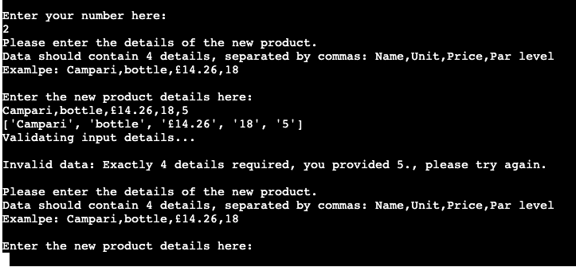
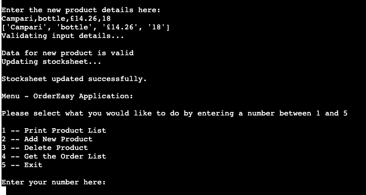
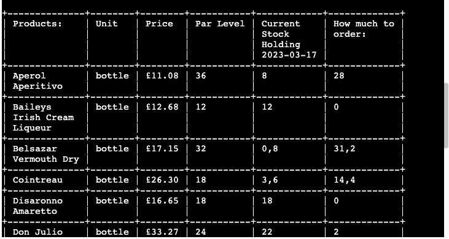

# OrderEasy Application

This application is designed to cater to the needs of all users who work in any environment that involves stocks and their management, especially the ordering part. The primary objective of the app is to simplify and speed up the process of managing stocks for its users. 
The main focus is to be straight forward enough to save time for the user, yet to be engaging and motivating at the same time.

The user can interact with the application in various ways such as viewing the current list of products, adding or removing products with relevant details from the stock list. The app also assists the user in determining how much of each product needs to be ordered based on their input of current stock holding information, which is compared to par levels by the application.

Furthermore, the app stores all stock information and data in an external Google Spreadsheet for easy access and management.

[Link to the live project](https://order-easy-python-milestone.herokuapp.com/)

The business goals of this website are:
  -	To deliver a high-quality application that addresses all stock management issues efficiently
  -	To provide an excellent user experience that is both efficient for each client and easy to use
  - To simplify the management of the product list, thanks to the use of Google Spreadsheet and the update options 
    on the app
  - To always provide accurate results with the current date noted

The customer goals of this website are:
  -	To search for an application that is user-friendly and easy to navigate
  -	To have a website where they can easily add, remove, and change their product list to adapt to current trends and needs
  - to reduce the amount of time users have to spend away from their customers while managing their stocks 
    and placing orders for new items
  - To make stock management and ordering simpler and easier to train new employees, ultimately reducing stress and 
    improving overall efficiency

# Contents

- [User Experience (UX)](https://github.com/Lilla-Kavecsanszki/order-easy#user-experience-ux)
- [Ideal client](https://github.com/Lilla-Kavecsanszki/order-easy#ideal-client)
- [User stories](https://github.com/Lilla-Kavecsanszki/order-easy#user-stories)
- [Flow Charts](https://github.com/Lilla-Kavecsanszki/order-easy#flow-charts)
- [Languages Used](https://github.com/Lilla-Kavecsanszki/order-easy#languages-used)
- [Frameworks, Libraries, Programs & Technologies Used](https://github.com/Lilla-Kavecsanszki/order-easy#frameworks-libraries-programs--technologies-used)
- [Features](https://github.com/Lilla-Kavecsanszki/order-easy#features)
- [Deployment](https://github.com/Lilla-Kavecsanszki/order-easy#deployment)
- [Testing](https://github.com/Lilla-Kavecsanszki/order-easy#testing)
  - [Manual Testing](https://github.com/Lilla-Kavecsanszki/order-easy#manual-testing)
  - [User Stories Testing](https://github.com/Lilla-Kavecsanszki/order-easy#user-stories-testing)
  - [Further Testing](https://github.com/Lilla-Kavecsanszki/order-easy#further-testing)
  - [Bugs](https://github.com/Lilla-Kavecsanszki/order-easy#bugs)
- [Credits](https://github.com/Lilla-Kavecsanszki/order-easy#credits)
  - [Content](https://github.com/Lilla-Kavecsanszki/order-easy#content)
  - [Acknowledgments and Code](https://github.com/Lilla-Kavecsanszki/order-easy#acknowledgments-and-code)
  - [Disclaimer](https://github.com/Lilla-Kavecsanszki/order-easy#disclaimer)

# User Experience (UX)

### Ideal client

The ideal client for this business is:

-	English speaking
-	Works with any types of stock
-	Needs to order stocks
-	Individuals, or companies

Visitors of this app search for:
-	A knowledgeable app that is easy to use
- That helps reducing the user's time spending on this specific task
- That is relyable and accurate

This application is the best way to help them achieve these goals because:
-	The menu makes the access of different commands very easy to execute
- The menu keeps coming back on display until the user chooses to exit the app
- The program will display all relevant information that can be necessary to order the products; with their name, unit types, prices, how much the user currently has on stock, the ideal par level and therefore how much needs to be ordered. 
- The product list can be easily updated with a new product and/or deleting one. 

This application:
-	Is easy to navigate by the menu
-	Gives the customers options and access to useful and learnable information.
-	Gives the customers the information they need without overloading them or distracting them from their original ideas or 
  wishes.
-	Guides them by their curiosity about the goal of the website.

[Back to top](https://github.com/Lilla-Kavecsanszki/order-easy#contents)

### User stories

1.	As a user of the application, I want to easily navigate the app, so I can find what I need quickly
2.	As a potential new user to the application, I want to understand what my options are
3.	As a user of the application, I want to be able to retrieve the list of products that I have on stocks to make the stock count, and therefore the later input faster, more efficient.
4.	As a user of the application, I want to be able to add a new product to the stock list, in case my business needs a new, different product with time
5.	As a user of the application, I want to be able to remove, delete an existing product from the stock list, in case my business doesn't need that specific product anymore
6. As a user of the application, I want to be able to see the results, as in how much I need to order and the date when the data was entered, and requested too
7. As a user of the application, I want to be able to see the relevant information of each product when I am ready to order them for better consideration, including their price, units as well. 

[Back to top](https://github.com/Lilla-Kavecsanszki/order-easy#contents)

# Flow Charts

Home page - Menu
 

Option1 - Print Product List
 

Option2 - Add New Product
 

Option3 - Delete Product
 

Option4 - Get the Order List
 

 

[Back to top](https://github.com/Lilla-Kavecsanszki/order-easy#contents)

# Languages Used

Python was used to complete this project.

[Back to top](https://github.com/Lilla-Kavecsanszki/order-easy#contents)

# Frameworks, Libraries, Programs & Technologies Used

- [Miro](https://miro.com/) was used to create the flow charts
- Github was used as the respository for the projects code after being pushed from Git
- Git was used for version control by the Gitpod terminal to commit to Git and Push to GitHub; to create and edit all 
  original code
- Google Spreadsheets was used as the external data store for stock data used by the project
- Google Drive API was used to generate credentials used in the project to securely access the Google Spreadsheet
- Google Sheets API was used to support interactions (e.g. read/write functionality) between the code and data stored in 
  the Google Spreadsheet
- gspread is the Python API for Google Sheets
- Google Auth is the Google authentication library for Python required to use the credentials generated for Google Drive 
  API
- Heroku was used to deploy the application and provides an enviroment in which the code can execute

[Back to top](https://github.com/Lilla-Kavecsanszki/order-easy#contents)

# Features

#### Home - The Menu

The menu is displayed when the application starts to keep the interface simple to use and uncluttered. The menu features five options, functionalities for the user to choose from; 1) Print Product List, 2) Add New Product, 3) Delete Product, 4) Get the Order List and 5) Exit.

The user is prompted to choose one of the menu options by entering the option number. In the event of an invalid input, an error message will be displayed and the main menu will be displayed again. 

The menu will continue to be displayed repeatedly until the user inputs a valid response and after the completion of each options (1-4). The application will be terminated only when the user selects option 5 from the menu.

#### Option 1 - Print Product List

If the user selects option 1 from the menu they are shown the list of the products that are currently on the stocks sheet in the Google Spreadheet.

This is data taken from the Google Spreadheet, all information listed under each other from its first column. 

Products added or deleted while using the application will be reflected on the list when the 'Print Product List' option is subsequently run.

#### Option 2 - Add New Product

The user can add a new product by choosing option 2 from the menu. The application displays a message on screen listing the input requirements and also an example input string of values for better understanding.

In the event that the user inputs do not satisfy the validation criteria, they will be prompted to re-enter the required information. The explanation of the data needed is displayed again too. 

The rules for the input values:

- Inputs are separated by commas
- 4 values are required
- The 4th value, the par level, needs to be an integer so that the program can use it for calculations later on

When the user inputs valid data the application displays multiple messages to assure the user with information on how the data is being processed and a new row is added to the stocks spreadsheet for the new product. Once the operation is complete it returns to the menu.

The updated Google Spreadsheet:

#### Option 3 - Delete Product

The user can remove, delete an already existing product by choosing option 3 from the menu. The application displays a message on screen explaining the input requirement and also an example input string of value for better understanding.

In the event that the user inputs do not satisfy the validation criteria, they will be prompted to re-enter the required information. The explanation of the data needed is displayed again too. 

The rules for the input values:

- At least 1 string of input is required, not a whitespace
- The product name cannot be left empty

When the user inputs valid data the application displays multiple messages to assure the user with information on how the data is being processed. There are 2 ways where the operation can go; if the program finds a match with the input on the stocks spreadsheet, another message will be dispayed and the first found (matched) item, with its entire row relevantly gets deleted from the stocks spreadsheet for the mentioned product. Always only the first match, in case the user needs the other copy to stay in stocks. Once the operation is complete it returns to the menu.

The updated Google Spreadsheet:

When the program doesn't find a match with the input on the stocks spreadsheet, again a message will be dispayed; explaining that the mentioned product is currently not on stock. The product therefore cannot be deleted as does not exist and the program will take the user back to the menu so they can carry on with their work accordingly. 

#### Option 4 - Get the Order List

The main function of the program is when the user can gather relevant information on how much they need to order of their products on stock. They can do this by choosing option 4 from the menu. The application displays a message on screen prompting the user for the first action that they need to do and listing the input requirements, while also providing an example input string of values for better understanding. The program will always ask for the number of data that reflects the current product list on the stocks sheet. This number is calculated by the app by counting the lenght of the first column with values on the stock sheet and then subtracting 1 from it, in order to take the heading row into consideration. 
Therefore this number gets updated each time a new product was added or an existing one was deleted beforehand. 

In the event that the user inputs do not satisfy the validation criteria, they will be prompted to re-enter the required information. The explanation of the data needed is displayed again too. 

The rules for the input values:

- Inputs are separated by commas
- 'x' values are required, as many values as the program currently requires
- The input values need to be integers or floats so that they reflect stock take method standards and also the program can use them for calculations later on

When the user inputs valid data the application displays multiple messages to assure the user with information on how the data is being processed. First the program updates the stocks sheet with the user inputs and also adds the current date to the heading of the Current Stock Holding column (5th col) so the user can reference it. After that, the application calculates how much the user needs to order of each products. The application calculates this by taking the par level values from the 4th column and from those it subtracts the previously input current stock holding values, 5th column. The results then are uploaded in the stocks spreadsheet, in the 6th column named, How much to order.

The updated Google Spreadsheet:

After performing the necessary calculations and updating the stocks sheet with all the required data, the program presents the information to the user in a table format. This makes it easy and quick for the user to read and gather all the necessary information for placing a new order.
Once the operation is complete it returns to the menu.

#### Option 5 - Exit

The user can exit and terminate the application by choosing option 5 from the menu. As a final touch, the program displays a Goodbye message to the user.

[Back to top](https://github.com/Lilla-Kavecsanszki/order-easy#contents)

# Deployment

**How to Clone**

Steps
 

1. Go to the https://github.com/Lilla-Kavecsanszki/order-easy repository 
2. Click the Code button to the left of the green Gitpod button, then choose Local. 
3. Click on headings for HTTPS, SSH, and Github CLI to find their individual URL links. Choose the HTTPs one. 
4. Open your own terminal in your editor and change the current working directory to the location of where you want the 
   cloned directory to be. 
5. In the terminal type git clone, and then paste the URL you copied from the repository page. 
6. Press enter to complete.

 

**How to create and configure the Google spreadsheet and APIs**

Steps
 

1. Log in (or create) to your Google account
2. Create a Google Spreadsheet (order_spreadsheet) on Google Drive. Mine has 1 page; 'stocks'.
3. In row 1 of the stocks sheet, create the headings: Products, Unit, Price, Par level, Current Stock Holding, How much to 
   order
4. Then go ahead and fill out the sheet as needed. For the initial sample data used in this project click [here](https://.github.com/Lilla-Kavecsanszki/order-easy#content)
5. Set up APIs on the [Google Cloud Platform](https://console.cloud.google.com/welcome?project=ordereasy-378810)
6. Create a new project, so click on the “Select a project” button and then select “new project”. and 
7. Give it a unique name, then by clicking on “Select Project” again, go to dashboard
8. Setup Google Drive credentials
9. From the side menu (hamburger menu on the top) select "APIs and Services" and then "Library"
10. Search for Google Drive API
11. Select Google Drive API and click on the 'enable' button, which will take you to the API overview page.
12. Click the “Create credentials” button, then there is a form the fill out.
13. From the "Which API are you using?" dropdown menu, choose Google Drive API
14. For the "What data will you be accessing?" question, select Application Data
15. For the "Are you planning to use this API with Compute Engine, Kubernetes Engine, App Engine, or Cloud Functions?"     question, select No, I'm not using them
16. Click Next
17. Enter a Service Account name, then click Create
18. In the Role Dropdown box choose Basic > Editor then press Continue
19. You got taken to the next page, where those options can be left blank, click Done
20. On the next page, click on the Service Account that has been created
21. On the next page, click on the Keys tab
22. Click on the Add Key dropdown and select Create New Key
23. Select JSON and then click Create, which will trigger your credentials file to be downloaded  
    into our computer files
24. You also need to enable your Google Sheets API. So go back to the library again, and search for “google sheets”.  
25. Select the Google Sheets API, then click “enable” (there's no need for more credentials here)
Now you have your APIs enabled, and have your credentials file downloaded.  
26. Add your credentials file that you downloaded in step 23; so locate the json file wherever it is within your computer 
    files and simply drag and drop it into your Gitpod workspace.
27. Rename it to "creds.json" to make it easier to use
28. Open up the json file and find the client_email value here, copy this email address generated for your credentials. 
    Copy it without the quotes around it.
29. Go back to your spreadsheet and click the share button here
30. Paste in the client email, make sure “Editor” is selected, untick “Notify People”, and then click "share"
31. Make sure that gitignore file contains your creds.json file, then save and commit
32. Install gspread and google-auth libraries in the development environment using the 
    command 'pip3 install gspread google-auth'

 

**How to Fork**

Steps
 

1. Go to the https://github.com/Lilla-Kavecsanszki/order-easy repository 
2. Click the fork button in the top right of the screen, between the watch, and the star buttons.

 

**Deployment to Heroku**

Steps
 

The OrderEasy website is deployed using Heroku, this was done by:

1. Add dependencies in GitPod to requirements.txt file with command "pip3 freeze > requirements.txt"
2. Commit and push to GitHub
3. Go to the Heroku Dashboard
4. Click "Create new app"
5. Name app and select location
6. Choose the Settings tab and add Config Vars for Creds and Port (creds.json file)
   (as a second entry also add PORT for the key and 8000 for the value)
7. Add the buildbacks to Python and NodeJS in that order
8. Now go to Deploy tab
9. Select GitHub as deployment method
10. Connect to GitHub and link to repository
11. Enable automatic deployment or deploy manually
12. Click on Deploy

 

[Back to top](https://github.com/Lilla-Kavecsanszki/order-easy#contents)

# Testing

Python Validator result on the run.py file
 

 

### Manual Testing

Details
 

**Menu:** Load or run the program to confirm that the menu gets displayed and responds correctly. It also gets displayed each time after the completion of each options (1-4). It terminates when the user chooses to exit by option 5. 

**Option 1 - Print Product List:** Enter the number 1 then hit enter to confirm that a reassuring message gets displayed then after the list of current pruducts, as well. Add a new product with option 2 or delete one with option 3 to confirm that the Products List gets updated accordinlgy when option 1 is selected from the menu afterwards.

**Option 2 - Add New Product:** Enter the number 2 then hit enter to confirm that 

**Option 3 - Delete Product:** Enter the number 3 then hit enter to confirm that

**Option 4 - Get the Order List:** Enter the number 4 then hit enter to confirm that

**Option 5 - Exit:** Enter the number 5 then hit enter to confirm that the goodbye message gets displayed and the application terminates.

[Back to top](https://github.com/Lilla-Kavecsanszki/order-easy#contents)

 

### User Stories Testing 

Details
 

1.	As a user of the application, I want to easily navigate the app, so I can find what I need quickly.

    - After the application loeaded, the first 'page' that the user can see is the Menu. The menu breaks down the functionalities into 5 main actions or options to select. The menu will continue to be displayed repeatedly after the completion of each options (1-4). The application will only be terminated when the user selects option 5 from the menu and exits. Therefore, the opportunity to easily select from the menu again is always available to the user after they finish a task.

2.	As a potential new user to the application, I want to understand what my options are

    - The menu is the first interaction with the user and pops up again after each task completion. 

   

3.  As a user of the application, I want to be able to retrieve the list of products that I have on stocks to make the 
    stock count, and therefore the later input faster, more efficient.

    - The first option, Print Product List, in the menu helps the user just with that. It gathers all product names that are currently on the stock list and presents them under each other. In case there were products added or deleted from the stock while using the application, those will be reflected on the list when the 'Print Product List' option is subsequently run again.
    
    

    - After a new product was added.
    
    

4.  As a user of the application, I want to be able to add a new product to the stock list, in case my business needs a 
    new, different product with time.

    - The second option, Add New Product, in the menu helps the user just with that. First the program dislays its requirements, what details it need from the user to input in order to be able to upload the new product to the Google sheet and add it to the stock list. When the user input the correct, valid data, the program will display some messages to reassure the user that their request is being processed and completed.
    
    .  

5.  As a user of the application, I want to be able to remove, delete an existing product from the stock list, in case my
    business doesn't need that specific product anymore.

    - The third option, Delete Product, in the menu helps the user just with that. First the program dislays its requirements, what details it need from the user to input in order to be able to find the mentioned product in the Google sheet and then delete it from the stock list. When the user input the correct, valid data, the program will display some messages to reassure the user that their request is being processed and completed. In case there is a repetition in the list, the app will only delete the first copy, leaving the rest of them on the list.
    
    .  

6.  As a user of the application, I want to be able to see the results, as in how much I need to order and the date when 
    the data was entered, and requested too.

    - The fourth option, Get the Order List, in the menu helps the user just with that. First the program dislays its requirements, what details it need from the user to input, which is their stock take results. Once the user enters the correct and valid data, the program reassures the user with messages that their request is being processed. The application updates the date in the heading to today's date, uploads the inputted values to the Google sheet, and calculates the required quantity for each item. The calculation is based on the par level values and their difference with the previously taken stock take values. Once all calculations and actions are completed, the application displays the data from the stocks sheet in a table format for easy readability by the user.
    
    .  

7.  As a user of the application, I want to be able to see the relevant information of each product when I am ready to 
    order them for better consideration, including their price, units as well.

    - The table at the completion of option 4, Get the Order List, displays many useful information of each products, namely their unit, their price, their set par level, their current stock holding amounts with the date when this input was created and lastly the amount of how much the user needs to order.
    - In addition to facilitating quick decision-making on how much of each product the user should order, this information can also be utilized to identify product trends and popularity, determine potential changes required in par levels, calculate gross profit, and steer the business towards economic profitability.

    . 

[Back to top](https://github.com/Lilla-Kavecsanszki/order-easy#contents)

 

### Further testing

Details
 
I asked friends and family to look at the application on their browsers and report any issues they find. This time my focus was on UX and how understandable and easy the application is to use. Some print and ValueError messages were adjusted as a result of this.

 

[Back to top](https://github.com/Lilla-Kavecsanszki/order-easy#contents)

## Bugs

An issues came up while testing the application in the meantime; 

- The 'Delete Product' function got into some issues when attempting to delete an existing product due to case sensitivity. Specifically, the function was unable to locate a product if it was inputted in lowercase or capitalized incorrectly. To address this issue, I utilized the capitalize() method in both the get_new_product() and get_deleted_product() functions. This modification ensures that the user inputs are formatted to start with a capital letter, regardless of their original input. As a result, the application can accurately locate and delete the requested products.

[Back to top](https://github.com/Lilla-Kavecsanszki/order-easy#contents)

# Credits

## Content

The Google spreadsheet (order_spreadsheet) that the application uses has the following fictitious initial data which was set up manually by the author:

Stocks Sheet
 

 

[Back to top](https://github.com/Lilla-Kavecsanszki/order-easy#contents)

## Acknowledgments and Code

I received inspiration for this project from my personal experience working in the hosptality industry, as well as from my partner's struggles with similar issues at his job. These experiences made me figure the logic for this project grately. In addition, I reviewed the work of other students to gain a better understanding of project scope and to identify best practices for Milestone Project 3.

The below websites have been used to understand the logic of building this project with Python.

How to convert data into integers and floats

https://stackoverflow.com/questions/74665788/how-to-convert-string-to-number-in-python
  
How to update cells and work the spreadsheet

https://docs.gspread.org/en/latest/user-guide.html#updating-cells
https://docs.gspread.org/en/latest/user-guide.html#getting-all-values-from-a-row-or-a-column
https://stackoverflow.com/questions/14625617/
https://stackoverflow.com/questions/30989213/can-i-control-the-output-of-insert-row-in-gspread

Checking data types

https://stackoverflow.com/questions/1549801/what-are-the-differences-between-type-and-isinstance

Exit in Python

https://www.askpython.com/python/examples/exit-a-python-program

Menu

https://computinglearner.com/how-to-create-a-menu-for-a-python-console-application/?utm_content=cmp-true

Delete a row that is containing a certain data

https://stackoverflow.com/questions/65313107/python-google-sheets-api-searching-for-a-certain-string-and-returning-the-wh
https://stackoverflow.com/questions/61599272/google-sheets-search-column-for-value-using-python
https://docs.gspread.org/en/v5.3.0/api.html

Print into table format - order results

https://www.geeksforgeeks.org/how-to-make-a-table-in-python/
https://pypi.org/project/tabulate/
https://openbase.com/python/tabulate/documentation

How to edit a dropdown link in the README

https://chrisfrew.in/blog/dropdowns-in-readmes/

I also would like to express my gratitude to Elaine Roche, my mentor, and the tutoring team for their continuous support and valuable feedback. Their guidance, tips, and resources have been instrumental in my coding and testing skills.

## Disclaimer

This application is for educational use only.

[Back to top](https://github.com/Lilla-Kavecsanszki/order-easy#contents)